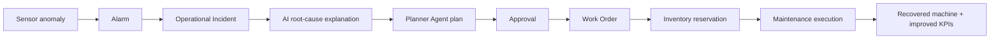

# YantraMitra

Industrial operations intelligence for plant teams, maintenance teams, and AI-assisted command centers.

YantraMitra is built from the original 20 Google Stitch HTML screens and keeps that standalone frontend structure intact. The backend is a real Express + Prisma + PostgreSQL service with JWT auth, bcryptjs password hashing, database-backed plant/machine/alarm/work-order data, and the YantraNklan AI operations assistant.

The seeded demo is now an India-first industrial scenario: Pune automotive components, Ahmedabad textile/chemical processing, Chennai electronics assembly, Bengaluru precision/R&D fabrication, and a Nagpur logistics hub, all pinned with real city latitude/longitude.

## Current Stack

| Layer | Implementation |
|---|---|
| Frontend | 20 standalone HTML pages in `frontend/*/code.html`, Tailwind CDN, Material Symbols |
| Shared UI | `public/js/app_shell_yantramitra.js` adds the shared right nav rail, home auth safety, and YantraNklan entry |
| Backend | Node.js, Express |
| Database | PostgreSQL, Prisma ORM |
| Auth | JWT in httpOnly cookies, bcryptjs password hashing |
| AI | OpenAI `gpt-4o-mini` when `OPENAI_API_KEY` is set; database lookup fallback when the key is missing, invalid, or quota-limited |
| Deployment | Vercel serverless through `api/index.js` and `vercel.json` |

## Demo Scenario

`node seed.js` creates:

- 5 Indian facilities across Pune, Ahmedabad, Chennai, Bengaluru, and Nagpur
- Company hierarchy for Yantra Manufacturing Technologies Pvt. Ltd.: 5 plants, 14 buildings, 27 production lines, machines, components, and sensors
- 29 domain-specific machines with serials, manufacturers, criticality, OEE, failure probability, remaining useful life, assigned floor position, and AI summaries
- 87 components, 174 configured sensors, 58 inventory part rows, and 58 maintenance history events
- 16,704 sensor readings across temperature, vibration, pressure, RPM, power, and flow
- Active alarm history, maintenance plans, persisted agent missions, and work orders
- 7 named team members with distinct roles and avatars
- 1 seeded operational incident that connects anomaly, alarm, AI reasoning, plan, work order, inventory reservation, and recovery timeline

The Digital Twin page uses Three.js to render clickable machine geometry. Faulted machines are shown in red with a visible warning glow. The inspector panel shows hierarchy, live seeded readings, OEE, RUL, sensors, components, spare parts, maintenance timeline, and can create a real work order or deep-link to YantraNklan with machine context.

## Screenshots / Visual Notes

The home and auth flow now present the real five-facility Indian demo company rather than generic factory stock art. The landing hero shows Pune automotive, Ahmedabad textile/chemical, Chennai electronics, Bengaluru precision engineering, and Nagpur warehouse visuals, plus a live-feeling operations widget seeded at 5 facilities, 29 machines, and 174 monitored sensors. When a user is signed in, the widget refreshes from the database APIs; logged-out visitors only see Login and Sign Up in the home header.

Home, login, signup, reset password, and onboarding share a subtle indigo/teal motion treatment that respects `prefers-reduced-motion`. The favicon is derived from the simplified YantraMitra logo mark for legible browser-tab rendering.

## Connected Operating Workflow

Phase 2 adds a persisted lifecycle backbone:



The shared app shell now adds a command palette (`Ctrl/Cmd + K`), notification center, incident replay modal, export/share/history/details/compare handlers, and workflow actions that call real APIs.

## Setup

```bash
npm install
cp .env.example .env
```

Required environment variables:

| Variable | Required | Notes |
|---|---:|---|
| `DATABASE_URL` | Yes | Runtime Postgres URL. For Neon on Vercel, use the pooled `-pooler` URL. |
| `DIRECT_URL` | Yes | Direct Postgres URL for Prisma migrations and seed. |
| `JWT_SECRET` | Yes | Long random secret for JWT signing. |
| `OPENAI_API_KEY` | No | Enables full YantraNklan LLM responses. Without it, the chat uses database lookup fallback. |
| `ENABLE_DEMO_PASSWORD_RESET` | No | Set `true` only for demo/dev reset-password testing. Keep false in production. |

Create/update the database and seed demo data:

```bash
npx prisma db push
node seed.js
```

Run locally:

```bash
npm start
```

Local URL: `http://localhost:3000`

## Demo Login

| Role | Email | Password |
|---|---|---|
| Admin | `admin@yantramitra.com` | `password123` |
| Operator | `operator@yantramitra.com` | `password123` |

Signup supports these persisted roles: `operator`, `maintenance`, `plant_manager`, and `executive`. The onboarding role cards map into those roles and update the user profile.

## Route Map

| Route | Page |
|---|---|
| `/` | Landing page |
| `/login` | Login |
| `/signup` | Signup |
| `/reset-password` | Reset password |
| `/onboarding` | Role onboarding |
| `/dashboard` | Global command center |
| `/map` | Global operations map |
| `/plant/:id` | Plant overview for a seeded Indian facility, for example `/plant/pune-auto` |
| `/digital-twin` | Digital twin |
| `/assets` | Asset fleet |
| `/assets/:id` | Asset detail for a seeded machine |
| `/anomaly` | Anomaly investigation |
| `/reliability` | Reliability forecast |
| `/simulator` | Scenario simulator |
| `/ai-console` | YantraNklan AI operations console |
| `/agents` | Agent mission control |
| `/plans` | Plan review |
| `/maintenance` | Maintenance planner |
| `/work-orders` | Work orders |
| `/settings` | Settings and profile |

Static info routes: `/privacy`, `/terms`, `/sitemap`, `/api-status`.

## Project Structure

```text
api/
  index.js                         Vercel serverless Express entry
frontend/
  */code.html                      20 original standalone UI screens
lib/
  prisma.js                        PrismaClient singleton for serverless
prisma/
  schema.prisma                    User, plant, machine, reading, alarm, agent, plan, work order models
public/
  images/                          Brand, operator, plant, AI, and industrial visuals
  js/                              Page controllers and shared app shell
server.js                          Express app, routes, auth, APIs, AI chat
seed.js                            Demo industrial data seed
vercel.json                        Build and routing config
```

## API Summary

Authentication:

| Method | Route |
|---|---|
| `POST` | `/api/auth/signup` |
| `POST` | `/api/auth/login` |
| `POST` | `/api/auth/logout` |
| `POST` | `/api/auth/reset-password` |
| `GET` | `/api/auth/me` |

Operations:

| Method | Route |
|---|---|
| `GET` | `/api/dashboard/summary` |
| `GET` | `/api/plants` |
| `GET` | `/api/plants/:id` |
| `GET` | `/api/machines` |
| `GET` | `/api/machines/:id` |
| `GET` | `/api/readings` |
| `GET` | `/api/alarms` |
| `PATCH` | `/api/alarms/:id/resolve` |
| `GET` | `/api/agents` |
| `POST` | `/api/agents` |
| `PATCH` | `/api/agents/:id` |
| `GET` | `/api/plans` |
| `POST` | `/api/plans` |
| `PATCH` | `/api/plans/:id` |
| `GET` | `/api/work-orders` |
| `POST` | `/api/work-orders` |
| `PATCH` | `/api/work-orders/:id` |
| `GET` | `/api/analytics/reliability` |
| `GET` | `/api/executive/summary` |
| `GET` | `/api/incidents` |
| `GET` | `/api/incidents/:id` |
| `POST` | `/api/incidents/:id/actions` |
| `GET` | `/api/notifications` |
| `PATCH` | `/api/notifications/:id` |
| `GET` | `/api/audit-log` |
| `GET` | `/api/command-palette` |
| `GET` | `/api/user/profile` |
| `PATCH` | `/api/user/profile` |
| `GET` | `/api/team` |
| `GET` | `/api/user/preferences` |
| `PATCH` | `/api/user/preferences` |
| `POST` | `/api/user/change-password` |
| `POST` | `/api/ai-chat` |

## YantraNklan

YantraNklan is the in-app AI operations assistant. It receives live database context for plants, machines, active alarms, agents, plans, and work orders. With `OPENAI_API_KEY`, it uses OpenAI `gpt-4o-mini`. If the key is missing, invalid, or quota-limited, `/api/ai-chat` returns a clear `fallback-data-lookup` response using the same database context, so the console remains useful during demos.

The AI console also exposes a microphone button in Chrome-based browsers through the native Web Speech API (`SpeechRecognition` / `webkitSpeechRecognition`). Unsupported browsers simply do not show the mic control.

## Guided Demo

The shared app shell adds a `Run Demo` button on the home page and dashboard. It auto-navigates through the major pages, highlights key UI areas, shows captions and progress, and completes in roughly 2 minutes 12 seconds at the default 11-second dwell per step.

## Production Notes

- Vercel needs `DATABASE_URL`, `DIRECT_URL`, `JWT_SECRET`, and optionally `OPENAI_API_KEY`.
- Neon serverless deployments should use pooled `DATABASE_URL` and direct `DIRECT_URL`.
- Password reset is demo-only unless `ENABLE_DEMO_PASSWORD_RESET=true`; production should connect a real email/token workflow.
- The seeded operations data is realistic demo data, not a replacement for a real historian, SCADA, CMMS, ERP, or IoT integration.
- Settings integrations persist connection state but do not perform real OAuth or vendor API calls.
- Admin-only mutations require an admin user role; demo operator users can read and use core flows.
